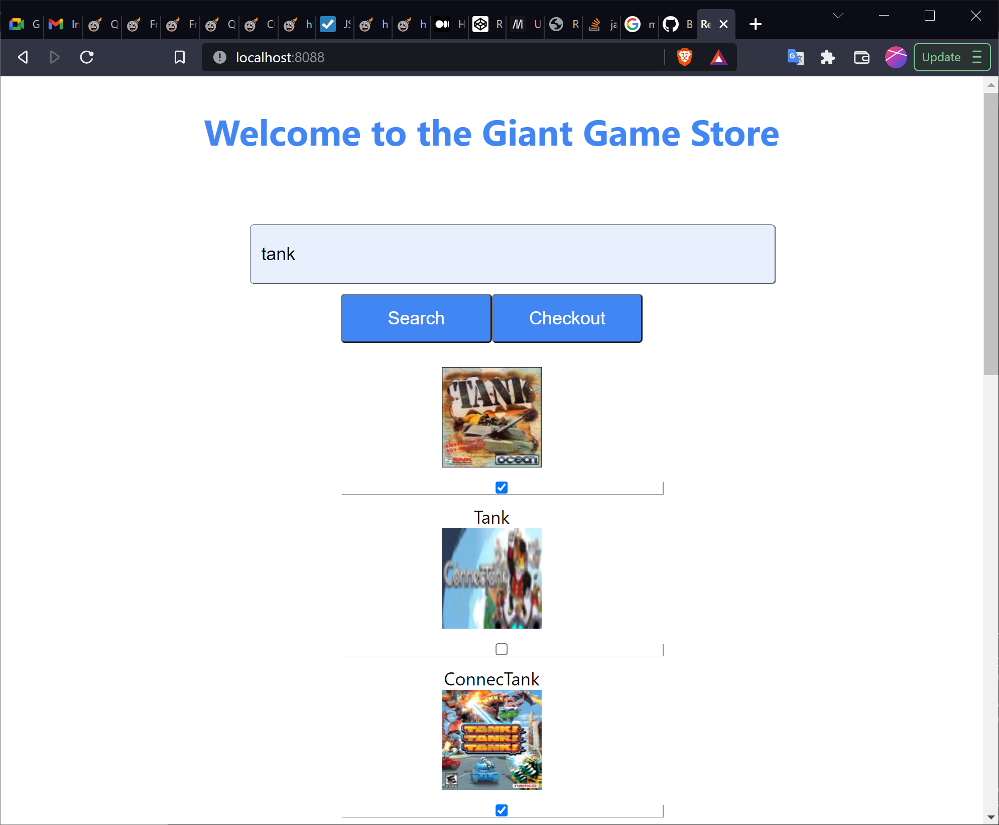

# Giant Game Store
* giantgameui - UI built with react, code (after build) need to be manually copied into spring-boot resources/static folder to be integrated
* giantgameapi - backend rest api build with spring boot. utilizes Giant Game API

